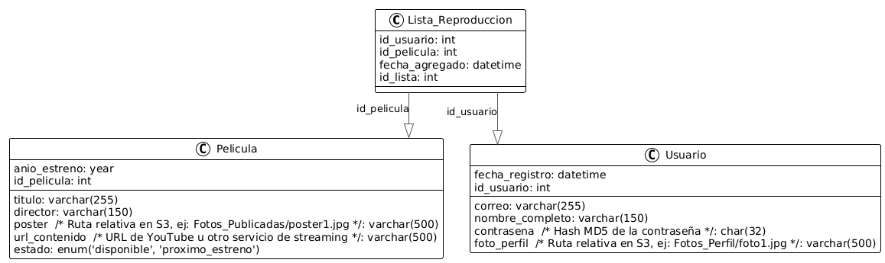
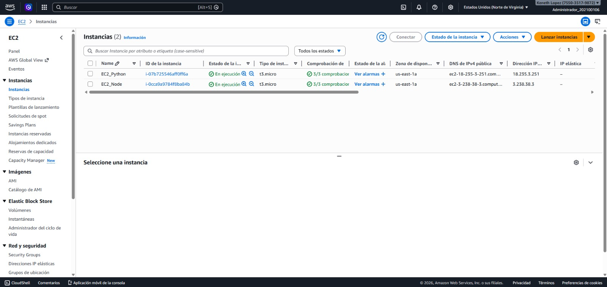
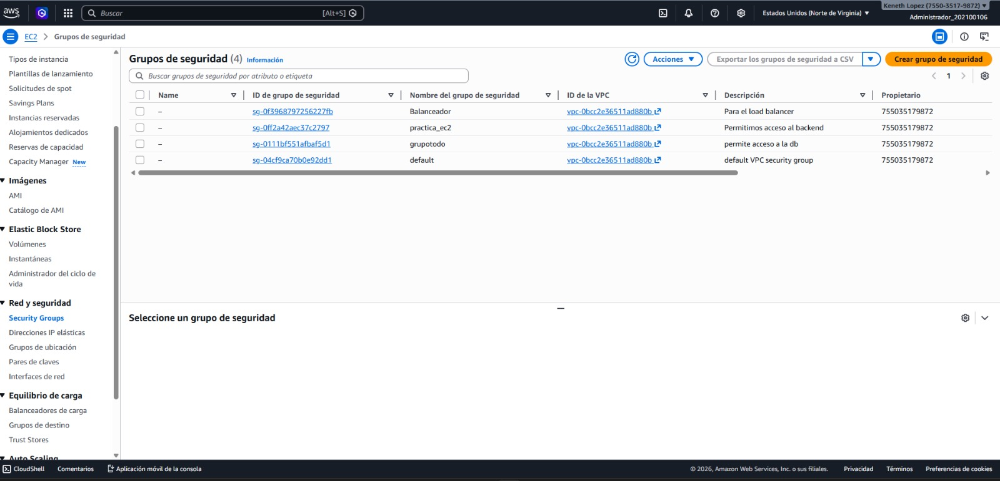
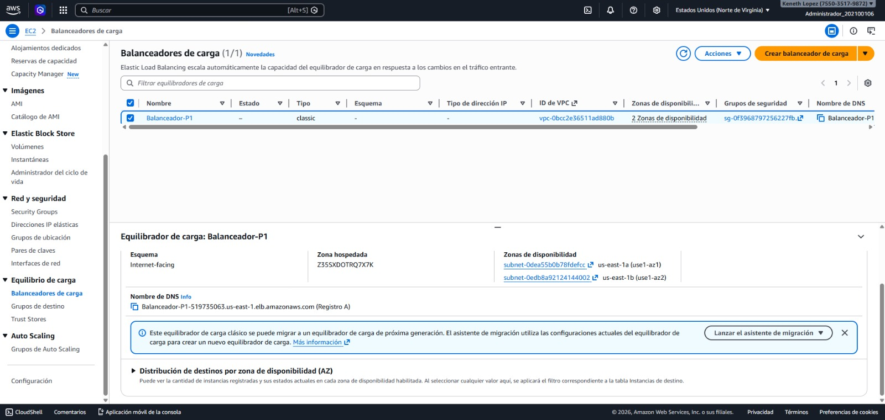
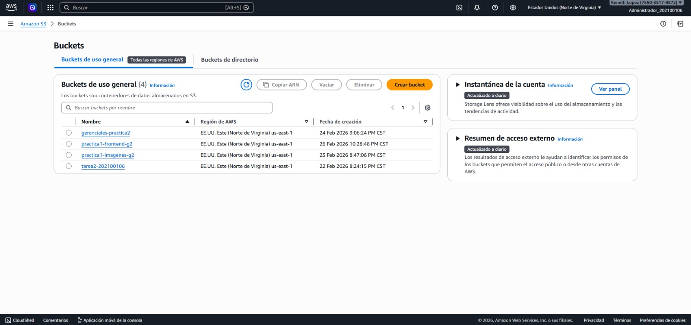
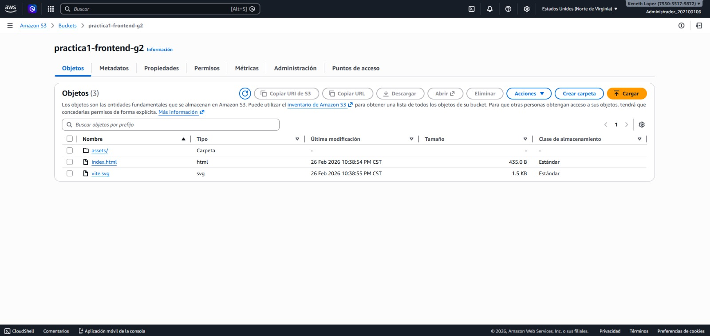
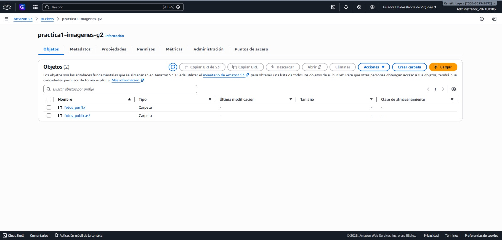
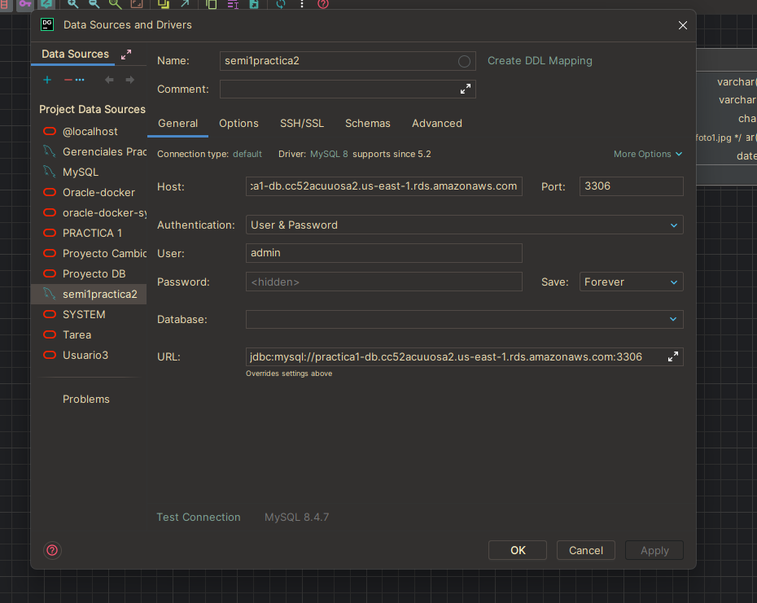

# Manual técnico - CLOUDCINEMA
### Curso: Seminario de Sistemas 1
### Sección: A
### Práctica 1

## Integrantes - Grupo 2:

| Nombre | Carné |
| --- | --- |
| Luis Carlos De Leon Toron| 202212535 |
| Keneth Willard Lopez Ovalle | 202100106 |
| Nelson Emanuel Cún Bálan | 201222010 |

## Introducción
El presente documento describe el proceso técnico para el desarrollo del sistema CloudCinema, una aplicación web que permite a los usuarios ver un catálogo de películas, crear listas de reproducción y poder ver las películas en streaming. El sistema se implementó utilizando servicios de Amazon Web Services (AWS) para garantizar escalabilidad, seguridad y alta disponibilidad. Este manual técnico detalla la arquitectura del sistema, los usuarios IAM y políticas de seguridad, así como capturas de pantalla de los componentes clave de la infraestructura.

## Objetivos
### Objetivo General
Desarrollar una aplicación web de streaming de películas utilizando servicios de AWS, que permita a los usuarios acceder a un catálogo de películas, crear listas de reproducción y ver detalles de las obras de manera segura y eficiente.

### Objetivos Específicos
1. Diseñar y configurar la arquitectura de AWS para soportar la aplicación CloudCinema utilizando balanceadores de carga para tráfico ininterrumpido.
2. Implementar políticas de seguridad utilizando IAM para controlar el acceso a los recursos de AWS y Security Groups.
3. Desplegar la aplicación web utilizando un entorno distribuido: dos instancias EC2 diferentes procesando peticiones a través de backend y una base de datos RDS con contraseñas seguras.
4. Integrar almacenamiento estático utilizando S3 tanto para alojar el frontend en React/Angular como para gestionar las fotos de perfil y portadas de películas.

## Arquitectura
El sistema CloudCinema está basado en una arquitectura distribuida en la nube, diseñada para separar responsabilidades entre presentación, lógica de negocio, almacenamiento de estado y almacenamiento estático. Esta segmentación permite escalabilidad, mantenimiento independiente de componentes y alta disponibilidad.

La infraestructura general de despliegue sigue este patrón de AWS:
- **Frontend S3:** La capa de presentación servida desde un Bucket estático público.
- **ALB (Application Load Balancer):** Actúa como puerta de enlace de tráfico para los backends, balanceando peticiones ecuánimemente entre EC2 NodeJS y EC2 Python.
- **EC2 (NodeJS & Python):** Servidores en instancias independientes que exponen la misma API REST unificada.
- **RDS:** Base de datos CloudCentralizada a nivel relacional en MySQL donde los passwords guardan checksums MD5 y se relacionan catálogos y playlists pero NO se guarda media binaria.
- **S3 Media Storage:** Dos directorios públicos alojando fotos de películas publicadas y fotos de perfil.

---

### App web pública / Frontend
La aplicación web se despliega en un **Bucket S3** configurado para actuar como Static Website Hosting (`Practica1-Web-G2`).
- Es consumida directamente mediante el navegador web del usuario final.
- Consume llamadas HTTP al punto de entrada DNS del Load Balancer (con los debidos headers y configs de CORS configurados correctamente en las APIs).
- Visualiza datos limpios sin lógicas de base de datos directas.

### Load balancer
El Application Load Balancer (ALB) de AWS recibe el tráfico de red de la aplicación web y lo distribuye entre las dos instancias EC2 que albergan los backends (NodeJS y Python). 
- Permite manejar la disponibilidad: Si la instancia NodeJS cae, el tráfico es enrutado automáticamente a la de Python.

### Servidor Web 1 / NodeJS
El servidor NodeJS que se ejecuta en su propia EC2 implementa la aplicación con Express.
- Gestión de usuarios (registro validando correo único, login, edición usando confirmación de password).
- Gestión del catálogo de películas.
- Administración de listas de reproducción.
- SDK de AWS: Construcción directa para subir archivos a S3.
- Integración nativa con la base de datos MySQL (RDS).

### Servidor Web 2 / Python
El servidor Python ejecutándose en su propia instancia (usando Flask) representa una implementación balanceada para el Load Balancer.
- API REST completamente equivalente a la implementada en NodeJS, consumiendo idénticamente Base de Datos (RDS) y S3 con el SDK Boto3.

### Bucket de imágenes S3
El almacenamiento de imágenes es descentralizado, fuera de RDS, alojándose en AWS S3 para su alta optimización.
Se utilizan prefijos estructurados sobre un bucket `Practica1-Images-G2` con permisos públicos automáticos (Políticas aplicadas de GetObject a todo).
- `Fotos_Perfil/`
- `Fotos_Publicadas/`

Las URLs públicas retornan al frontend el acceso directo:
`https://practica1-images-g2.s3.us-east-1.amazonaws.com/<key>`

### Base de datos RDS
Servicio gestionado de Amazon RDS empleando MySQL v8+. 
- Motor de BD: MySQL
- Hasheo de claves forzadas a MD5 en lado servidor (Nativo a APIs).
- Cero almacenamiento Blob; las imágenes dentro de usuarios se relacionan estáticamente mediante string como `Fotos_Perfil/user1.jpg`.

---

## Usuarios IAM y Políticas
Por un principio de "Menor Privilegio", para CloudCinema se emplearon roles y políticas separadas según los recursos:

1. **Usuario IAM para S3 (Access/Programático):** 
   - **Nombre de usuario IAM:** `api-s3-manager` *(o similar dependiente de la cuenta)*
   - **Políticas Asociadas:** `AmazonS3FullAccess` o una custom limitándose estricto al listado, lectura, borrado y escritura (`PutObject`, `GetObject`) únicamente para listar `Practica1-Images-G2`.
   - **Uso:** Empleado dentro de las variables `.env` de las EC2 NodeJS / Python SDK para que programáticamente publiquen nuevas imágenes de perfil seleccionadas.

2. **Usuario IAM Deployer EC2 (Consola/General):** 
   - **Políticas Asociadas:** `AmazonEC2FullAccess`, `ElasticLoadBalancingFullAccess`.
   - **Uso:** Empleado para provisionar la capa lógica y de máquinas virtuales, instanciar los Security Groups.

3. **Security Groups:** 
   - Las instancias EC2 poseen aperturas de puertos `80/443/3000` autorizando tráfico saliente (Egress 0.0.0.0/0).
   - El puerto RDS nativo (`3306`) se configuró bloqueado para peticiones externas, abriéndolo exclusivamente a peticiones originadas desde los Security Group origen de ambas VPC / Subnets de las EC2.

---

## Capturas de pantalla

### EC2 e Instancias (y Grupos de Seguridad)
Esta sección evidencia el aprovisionamiento de las nubes privadas, conteniendo Backend Node, Backend Python y Balanceadores.

### Load Balancer
Balanceador configurado redirigiendo en tráfico dividido a ambas instancias.

### Storage (Bucket de S3 - Web Config)
Evidencia de los dos almacenamientos separados.

### Base de datos RDS
Plataforma MySQL provisionada con conexiones exitosas externas.

## Consideraciones Adicionales y Requisitos Cumplidos
- Todo el despliegue del bucket es 100% estático.
- AWS SDK implementado de manera programática para que la subida de perfiles envíe la data física a AWS S3 y retorne url publicándola al motor DB con strings referenciados.
- Las dos instancias actúan sin ser dependientes.

## Conclusiones
La combinación de S3, EC2 autogestionado por balanceadores Load Balancer en capa 7 (HTTP) y el delegar los datos maestros a RDS proporcionan una potente prueba de concepto (PoC) en AWS capaz de soportar tráfico ininterrumpible. Las técnicas implementadas de Security Groups protegen la infraestructura interna, forzando a que las imágenes solo entren al servidor estático por las APIs certificadas y protegiendo el panel de Base de Datos de ataques públicos.